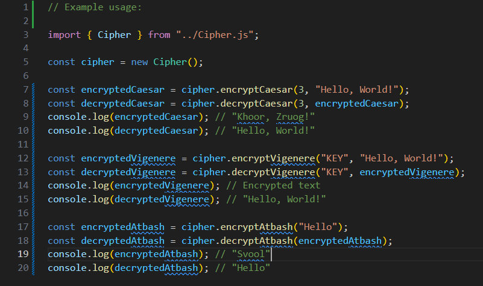

# Cipher Library

## This module is used to cipher and decipher strings of text using different cipher methods. It currently supports the Caesar Cipher method, the Vigenere Cipher method and the Atbash Cipher method.

 

## Reminders

this module uses the english alphabet (a-z) and alphabetic characters outside of this will be treated as non-alphabetic characters.

This module is written in Typescript and needs to be [compiled](https://code.visualstudio.com/docs/typescript/typescript-compiling).

 

## Installation Guide

### 1. Clone this repository to your local machine.

### 2. At the command prompt, run `npm install`.

    npm install

### 3. To compile the Typescript code into Javascript code, type `npx tsc` at the command prompt.

    npx tsc

### if you get an error while compiling, type `npm install -g typescript` at the command prompt then try compiling again.

    npm install -g typescript

    npx tsc

 
 

# Example code

